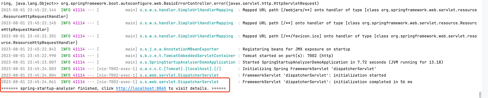

# spring-startup-analyzer-demo

spring-boot版本：1.5.22.RELEASE

## 运行

1. 编译

```shell
 mvn clean package
```

2. 安装spring-startup-analyzer

```shell
curl -sS https://raw.githubusercontent.com/linyimin0812/spring-startup-analyzer/main/bin/install.sh | sh
```

3. 执行

```shell
java -javaagent:/Users/yiminlin/spring-startup-analyzer/lib/spring-profiler-agent.jar -jar ./target/spring-startup-analyzer-demo-0.0.1-SNAPSHOT.jar
```


## 执行结果

